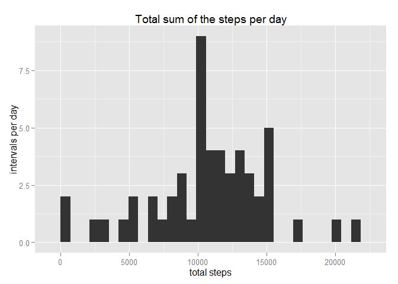
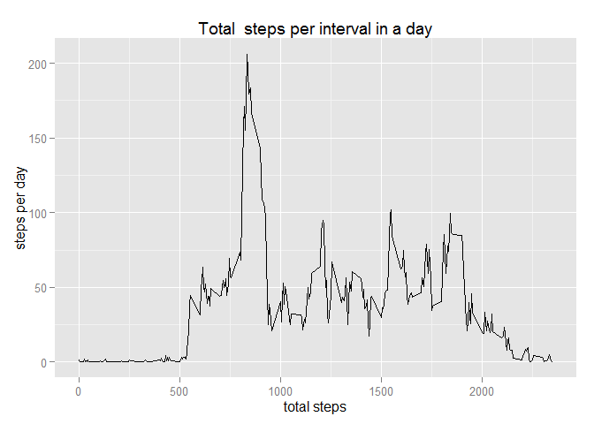
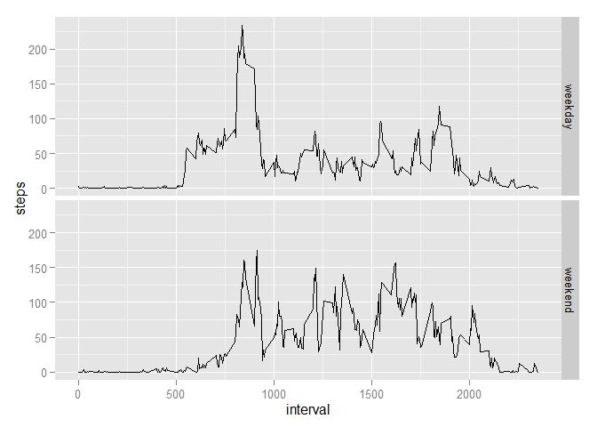

# Reproducible Research: Peer Assessment 1
**Load relevant libraries**

```r
library(knitr, dplyr);
```

```
## Warning: package 'knitr' was built under R version 3.1.3
```

```r
library(ggplot2);
```

```
## Warning: package 'ggplot2' was built under R version 3.1.3
```
## Loading and preprocessing the data
**Read the csv and store it as data **

```r
opts_chunk$set(cache=TRUE,echo=TRUE)
```

*Read the csv file into data variable*

```r
data <-  read.csv(file= "activity/activity.csv", header = TRUE);
str(data);
```

```
## 'data.frame':	17568 obs. of  3 variables:
##  $ steps   : int  NA NA NA NA NA NA NA NA NA NA ...
##  $ date    : Factor w/ 61 levels "2012-10-01","2012-10-02",..: 1 1 1 1 1 1 1 1 1 1 ...
##  $ interval: int  0 5 10 15 20 25 30 35 40 45 ...
```

```r
#converting date to date field
if(!is.numeric.Date(data$date)){
  data$date <- as.Date(data$date);
}
str(data);
```

```
## 'data.frame':	17568 obs. of  3 variables:
##  $ steps   : int  NA NA NA NA NA NA NA NA NA NA ...
##  $ date    : Date, format: "2012-10-01" "2012-10-01" ...
##  $ interval: int  0 5 10 15 20 25 30 35 40 45 ...
```

## What is mean total number of steps taken per day?

```r
total_per_day <- aggregate(steps ~ date, data, sum);
str(total_per_day);
```

```
## 'data.frame':	53 obs. of  2 variables:
##  $ date : Date, format: "2012-10-02" "2012-10-03" ...
##  $ steps: int  126 11352 12116 13294 15420 11015 12811 9900 10304 17382 ...
```

```r
ggplot(total_per_day, aes(steps)) + geom_histogram() + labs(x="total steps", y="intervals per day", title="Total sum of the steps per day" );
```

```
## stat_bin: binwidth defaulted to range/30. Use 'binwidth = x' to adjust this.
```

 

```r
#calculate mean
day_mean <- as.integer(mean(total_per_day$steps, na.rm=TRUE));

#calculate median
day_median <- median(total_per_day$steps)
```
**Mean is 10766 and Median is 10765**

## What is the average daily activity pattern?
1.Make a time series plot (i.e. type = "l") of the 5-minute interval (x-axis) and the average number of steps taken, averaged across all days (y-axis)

*Using dplyr package for this portion*

```r
data2 <- na.omit(data)
total_per_day <- aggregate(steps ~ interval, data2, mean);
str(total_per_day);
```

```
## 'data.frame':	288 obs. of  2 variables:
##  $ interval: int  0 5 10 15 20 25 30 35 40 45 ...
##  $ steps   : num  1.717 0.3396 0.1321 0.1509 0.0755 ...
```

```r
ggplot(total_per_day, aes(interval, steps)) + geom_line() + labs(x="total steps", y="steps per day", title="Total  steps per interval in a day" );
```

 

```r
findMax <- total_per_day[which.max(total_per_day$steps),]

#data2 <- na.omit(data);
#library(dplyr, ggplot2);
#data2 %>% group_by(interval) %>% summarize(s=mean(step)) %>% ggplot(aes(x=s, y=interval)) + #geom_histogram()

#str(daily_pattern);
#daily_pattern <- as.data.frame(daily_pattern);
#str(daily_pattern);
#qplot(daily_pattern, x=stepsmean);
#hist(daily_pattern$stepsmean)
#ggplot(daily_pattern, aes(stepsmean))+geom_line();
#+ geom_line() + labs(x="interval", y="steps", title="Daily pattern");
```
2. Which 5-minute interval, on average across all the days in the dataset, contains the maximum number of steps?
**Interval**835 with 206.1698113 steps

## Imputing missing values
Calculate and report the total number of missing values in the dataset (i.e. the total number of rows with NAs)

Devise a strategy for filling in all of the missing values in the dataset. The strategy does not need to be sophisticated. For example, you could use the mean/median for that day, or the mean for that 5-minute interval, etc.

**Mutate with dplyr**

```r
sumSteps <- sum(is.na(data$steps))
data2 <- data
data2 %>% group_by(interval) %>% mutate(steps= as.numeric(ifelse(is.na(steps), mean(steps, na.rm=TRUE), steps)));
```

```
## Source: local data frame [17,568 x 3]
## Groups: interval
## 
##        steps       date interval
## 1  1.7169811 2012-10-01        0
## 2  0.3396226 2012-10-01        5
## 3  0.1320755 2012-10-01       10
## 4  0.1509434 2012-10-01       15
## 5  0.0754717 2012-10-01       20
## 6  2.0943396 2012-10-01       25
## 7  0.5283019 2012-10-01       30
## 8  0.8679245 2012-10-01       35
## 9  0.0000000 2012-10-01       40
## 10 1.4716981 2012-10-01       45
## ..       ...        ...      ...
```

```r
#Create a new dataset that is equal to the original dataset but with the missing data filled in.

#Make a histogram of the total number of steps taken each day and Calculate and report the mean and median total number of steps taken per day. Do these values differ from the estimates from the first part of the assignment? What is the impact of imputing missing data on the estimates of the total daily number of steps?
total <- aggregate(steps ~ date, data2, sum)
ggplot(total, aes(steps)) + geom_histogram()
```

```
## stat_bin: binwidth defaulted to range/30. Use 'binwidth = x' to adjust this.
```

 

```r
newMean <- as.integer(mean(total$steps, na.rm=TRUE))
```
*Total missing values in steps are 2304
*New mean is 10766 * 


## Are there differences in activity patterns between weekdays and weekends?

```r
#install.packages('timeDate');
library(timeDate)

data2 <- mutate(data2, day=ifelse(isWeekday(data$date) == TRUE, "weekday", "weekend"));

#weekdays <- filter(data, isweekday(st$date) == TRUE);
#weekends <- filter(data, isweekend(st$date) == TRUE);
intervals_total <- data2 %>% group_by(interval, day) %>% summarise(steps=mean(steps, na.rm = TRUE));
ggplot(as_data_frame(intervals_total), aes(interval, steps)) + geom_line() +facet_grid(day ~ .)
```

 

**As you can see from the graphs above, weekend walking activity is much more active compared to Weekday activity**
